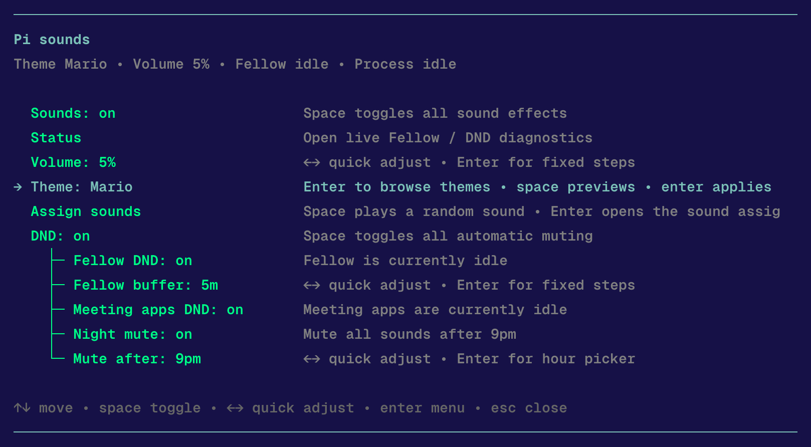
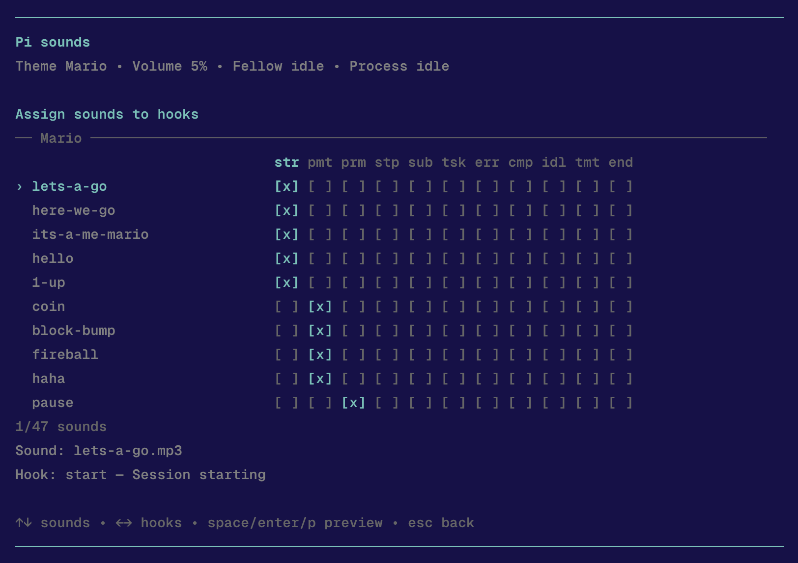

# pi-sounds

`pi-sounds` is a Pi extension that adds nostalgic sound effects and a `/sounds` dashboard.



It adapts the ideas and theme assets from [`ryparker/claude-code-sounds`](https://github.com/ryparker/claude-code-sounds) for Pi's extension system and TUI workflow, with Pi-specific settings, previews, and do-not-disturb controls.

## Features

- sound effects for Pi events
- `/sounds` dashboard for settings and previews
- `/sounds status` for quick diagnostics
- do-not-disturb support for:
  - meeting apps (`zoom.us`, `Zoom`, `Microsoft Teams`, `Teams`, `Webex`, `FaceTime`)
  - Fellow meeting integration when available
  - night mute after a chosen hour

## Install

From GitHub:

```bash
pi install https://github.com/cammcnab/pi-sounds
```

From a local checkout during development:

```bash
pi install /path/to/pi-sounds
```

Then reload Pi:

```text
/reload
```

After that, open:

- `/sounds`
- `/sounds status`

## Theme customization

The `/sounds` dashboard includes a theme picker plus an assignment grid for previewing how each theme maps sounds to Pi hooks.



## Bundled assets

This repo includes bundled sound themes under `themes/`.

Bundled theme options:

- `aoe2` — Age of Empires II
- `cnc` — Command & Conquer
- `cod` — Call of Duty
- `diablo2` — Diablo II
- `halo` — Halo
- `league-of-legends` — League of Legends
- `mario` — Mario
- `mgs` — Metal Gear Solid
- `pokemon-gen3` — Pokemon Gen 3
- `portal` — Portal
- `short-circuit` — Short Circuit
- `star-wars` — Star Wars
- `starcraft` — StarCraft
- `wc3-peon` — Warcraft III Peon
- `wh40k` — Warhammer 40K
- `zelda-botw` — The Legend of Zelda: Breath of the Wild
- `zelda-oot` — The Legend of Zelda: Ocarina of Time

The extension uses:
1. user themes in `~/.pi/sounds/themes/` when present
2. bundled themes from this repo otherwise

Runtime config is stored in:

- `~/.pi/sounds/config.json`

## Notes

- Playback currently uses macOS `afplay`.
- Meeting-aware DND is optional; Fellow support is used only when it is already available in Pi.
- Desktop notifications are intentionally not part of this extension.

## License

Theme assets and inspiration come from [`ryparker/claude-code-sounds`](https://github.com/ryparker/claude-code-sounds). See [`LICENSE`](./LICENSE).

